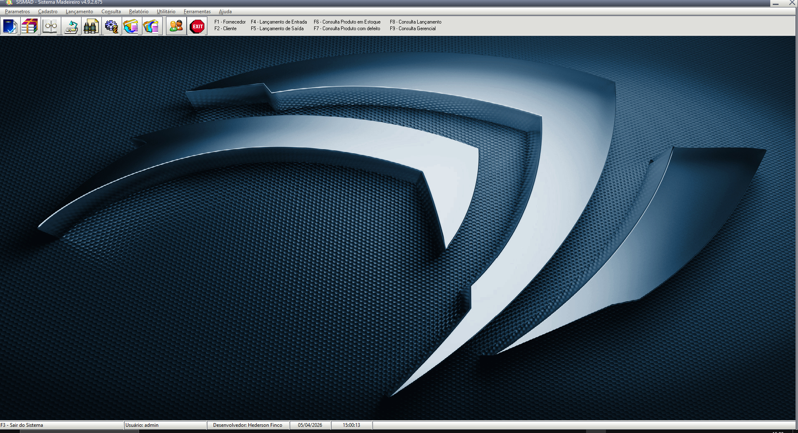

## SISCOMAD
**Status:** Sistema passando por refatoração 
**Tecnologia:** Delphi 7 + Firebird 
**Migração prevista:** 
- Delphi 7 para Delphi 12
- Firebird 2.5 para 5.0
- Implementação de módulo fiscal NFe via componentes ACBr   

O **SISCOMAD** é um sistema **ERP** **multiusuário**, com acesso **LAN/WAN**, voltado para atendender o setor madeireiro. 
- Gestão completa de estoque de produtos do setor madeireiro, controlando unidades em m³, m², metro linear e unidade (UN), atendendo às exigências da SEMA – Secretaria Estadual do Meio Ambiente.
- Controle de entrada, saída e movimentação de produtos, além de gestão financeira (contas a pagar e receber) e registro de ocorrências.
- Módulos de cadastro abrangentes: essências, produtos, fornecedores, clientes, setores, municípios, vendedores, categorias e subcategorias. Consultas detalhadas de estoque, produtos danificados, lançamentos por nota fiscal e
histórico financeiro.
- Geração de relatórios customizáveis para operações internas e atendimento às exigências regulatórias.   

- Tela de login: 
  
Tela principal: 
  

## 📋 Menus do Sistema

### 🔐 Login
- Login de usuário

---

### 🗂️ Parametros
- Parametros da empresa

---

### 🗂️ Menu Cadastro
- Cadastro de Essência
- Cadastro de Produto
- Cadastro de Padrão de venda
- Cadastro de Município
- Cadastro de Vendedor
- Cadastro de Setor
- Cadastro de Tipo de Contato
- Cadastro de Tipo de Fornecedor
- Cadastro de Clientes
- Cadastro de Categoria
- Cadastro de Sub-categoria

---

### 💰 Menu Lançamento
- Lançamento de Entrada
- Lançamento de Saída
- Lançamento de Contas a Pagar
- Lançamento de Contas a Receber
- Lançamento de Registro de Ocorrência

---

### 🔍 Menu Consulta
- Consulta Estoque por M3, M2, ML, UN
- Consulta Produtos Danificados
- Consulta por Pedidos
- Consulta por NF
- Consulta Demonstrativo de Compras e Vendas
- Consulta Status da Entrega

---

### 🛠️ Menu Relatório
- Relatório de Essência
- Relatório de Produto
- Relatório de Município
- Relatório de Fornecedor
- Relatório de Clientes
- Relatório de Entrada
- Relatório de Saída
- Relatório de Romaneio
- Relatório de Estoque
- Relatório de Fechamento de Venda

---

### 🛠️ Menu Utilitário
- Link direto para órgãos ambientais Estaduais
- Link direto para órgãos ambientais Federais

---

### ⚙️ Menu Ferramentas
- Backup / Restore
- Configuração do banco de dados
- Controle de usuário
- Logoff de usuário
- Limpeza do banco de dados
- Skin

---

### ❓ Menu Ajuda
- Dicas
- Últimas atualizações
- Verificar atualizações
- Conteúdo
- Enviar e-mail para suporte
- Visitar a página da HF na internet
- Sobre o sistema

